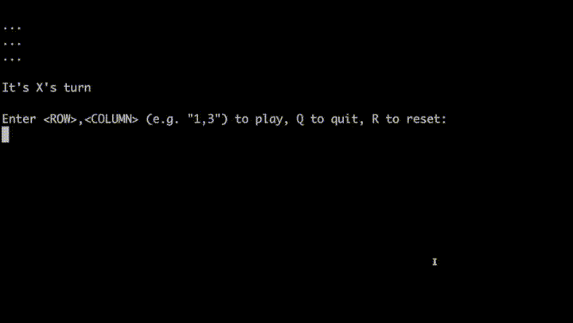

# Test-Driven-Tic-Tac-Toe

This is an example Tic-Tac-Toe implementation for demonstrating TDD. 

## How to navigate the code: 
1. Start with the tests (obviously 🙂): `GameTest` and `CliTest`
2. The `Game` class controls the game, `Cli` manages console input and output
3. Go back in time and see how the project grew from the early commits. Note the evolution of the `play(...)` method in the `Game` class.
4. Look at `todos.txt` and its history. This was the test list I used during development as new implementation ideas occurred.
5. 